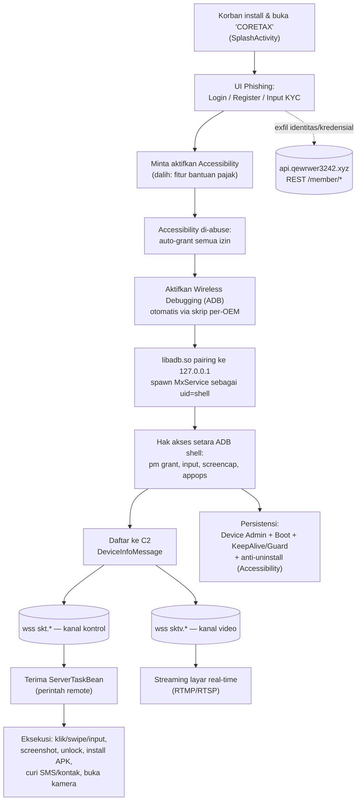

# Analisis Malware — "CORETAX.apk" (Android RAT / Banking Trojan)

> Dokumen analisis statik hasil dekompilasi (apktool + smali). Tujuan: edukasi & defensif — memahami cara kerja malware, memetakan Indicator of Compromise (IoC), dan alur serangan. **Jangan pasang/jalankan APK ini pada perangkat produksi.**

---

## 1. Ringkasan Eksekutif

Aplikasi menyamar sebagai **"CORETAX"** — meniru aplikasi pajak resmi Ditjen Pajak Indonesia (Coretax DJP) — namun sebenarnya adalah **Remote Access Trojan (RAT) + Banking Trojan** dengan kemampuan pengambilalihan perangkat penuh (*full device takeover*).

Karakteristik utama:

| Aspek | Temuan |
|---|---|
| **Kelas malware** | Android RAT / Banking Trojan / On-Device-Fraud (ODF) |
| **Penyamaran (lure)** | Aplikasi pajak "CORETAX" (target: Wajib Pajak Indonesia) |
| **Bahasa target** | Indonesia & Vietnam (string developer: Mandarin) |
| **Mekanisme inti** | Abuse **Accessibility Service** + **ADB Wireless Debugging lokal** untuk eskalasi hak akses setara `shell` (uid 2000) |
| **Kanal C2** | 1x REST (HTTPS) + 2x WebSocket (kontrol & video streaming) |
| **Domain C2** | `qewrwer3242.xyz` (sub: `api`, `skt`, `sktv`) |
| **Kemampuan** | Remote control real-time, screen streaming, keylogging, pencurian SMS/OTP, kontak, kredensial, PIN/pola kunci layar, bypass verifikasi wajah, install APK jarak jauh, anti-uninstall |
| **Persistensi** | Boot receiver, Device Admin, layanan keep-alive/guard proses ganda, native watchdog |

**Dampak:** Pencurian identitas (KYC), pengambilalihan akun perbankan/e-wallet, intersepsi OTP, dan kontrol penuh perangkat korban dari jarak jauh.

---

## 2. Identitas Aplikasi

| Field | Nilai |
|---|---|
| `apkFileName` | `Coretax.apk` |
| `package` | `com.cnfvgz.sxwe.rfmly` (nama acak/obfuscated) |
| `app_name` | `CORETAX` |
| `application class` | `com.remote.app.RemoteApplication` |
| `minSdkVersion` | 31 (Android 12) |
| `targetSdkVersion` | 36 |
| `extractNativeLibs` | `false` (native lib dibundel di dalam APK) |
| ABI | `arm64-v8a`, `armeabi-v7a` |

Nama paket `com.remote.*` dan `com.ven.assists.*` menunjukkan basis kode dibangun di atas framework otomasi **Assists** (accessibility automation) yang dipersenjatai.

---

## 3. Indicator of Compromise (IoC)

### 3.1 Jaringan / C2 (Network Indicators)

| Tipe | Indicator | Fungsi |
|---|---|---|
| Domain C2 | `qewrwer3242.xyz` | Domain induk C2 |
| REST (HTTPS) | `https://api.qewrwer3242.xyz` | API pendaftaran korban & exfiltrasi data |
| WebSocket | `wss://skt.qewrwer3242.xyz/ws/device?menberId=%s&deviceId=%s` | Kanal **kontrol/perintah** (Action) |
| WebSocket | `wss://sktv.qewrwer3242.xyz/ws/device?menberId=%s&deviceId=%s` | Kanal **video/screen streaming** |

> Catatan: parameter typo `menberId` (harusnya *memberId*) adalah IoC tekstual yang khas dan bisa dipakai untuk deteksi network signature.

### 3.2 Endpoint REST API (Exfiltrasi)

| Endpoint | Data yang dikirim |
|---|---|
| `POST /member/info/addDevice` | Registrasi perangkat korban + info perangkat (DeviceInfo) |
| `POST /member/info/addDevicePassword` | Password/PIN hasil form phishing |
| `POST /member/info/addsDevicePassword` | Password perangkat (scheduler / WebView bridge) |
| `POST /member/info/addsKeyboardInput` | Hasil **keylogger** (input keyboard) |
| `POST /member/info/addMessage` | **SMS/OTP** yang diintersepsi |
| `POST /member/identity_verification/saveInfo` | Data identitas/KYC korban |
| `POST /member/identity_verification/saveSecurityCode` | Kode keamanan / 2FA |

### 3.3 Komponen Aplikasi (Package Indicators)

```
com.cnfvgz.sxwe.rfmly                         <- package name
com.remote.app.RemoteApplication              <- Application entry
com.remote.app.ui.activity.SplashActivity     <- Launcher (via SplashActivityAlias)
com.ven.assists.service.AssistsService        <- Accessibility Service (BIND_ACCESSIBILITY_SERVICE)
com.remote.framework.receiver.RemoteDeviceAdminReceiver  <- Device Admin
com.remote.framework.receiver.BootCompletedReceiver      <- Persistensi boot
com.remote.framework.keepalive.KeepAliveService/GuardService  <- Keep-alive (proses :guard)
com.remote.server.mx.MxService                <- Privileged binder server (via ADB shell)
com.remote.framework.adb.AdbPairingService    <- Local ADB pairing service
com.remote.framework.media.screenrecord.ScreenRecordService
com.remote.framework.media.screenshot.ScreenshotService
```

**Content Provider authorities (IoC):**
```
com.cnfvgz.sxwe.rfmly.fileprovider
com.cnfvgz.sxwe.rfmly.mx
com.cnfvgz.sxwe.rfmly.assets.fileprovider
com.cnfvgz.sxwe.rfmly.messenger
```

### 3.4 Native Libraries (File Indicators)

| Library | Fungsi |
|---|---|
| `libadb.so` | Klien ADB tertanam — melakukan pairing & koneksi wireless-debug **ke localhost** (`127.0.0.1`) |
| `libmx.so` | Engine "MX" privileged — screen capture & injeksi sentuhan lewat hak `shell` |
| `libkeepalive.so` | Native watchdog/persistensi |
| `libmlkit_google_ocr_pipeline.so` | **OCR** (Google MLKit) — membaca teks di layar |
| `libmmkv.so` | Penyimpanan konfigurasi (Tencent MMKV) |

### 3.5 Aset (Asset Indicators)

```
assets/adb/{default,google,samsung,xiaomi,oppo,vivo,huawei}.json  <- skrip otomasi accessibility per-OEM
assets/mlkit-google-ocr-models/                                    <- model OCR TFLite
assets/dexopt/baseline.prof(m)
```

File `assets/adb/*.json` berisi kata kunci multibahasa (Mandarin, Inggris, **Indonesia**, **Vietnam**) untuk menavigasi menu Setelan dan mengaktifkan *Wireless debugging* secara otomatis.

### 3.6 Izin Berbahaya (Permission Indicators)

```
WRITE_SECURE_SETTINGS      <- sangat berbahaya (normalnya khusus sistem/ADB)
READ_SMS                   <- intersepsi OTP
READ_CONTACTS / WRITE_CONTACTS
CAMERA                     <- bypass verifikasi wajah
FOREGROUND_SERVICE_MEDIA_PROJECTION  <- rekam/stream layar
RECEIVE_BOOT_COMPLETED     <- persistensi
REQUEST_IGNORE_BATTERY_OPTIMIZATIONS
BIND_ACCESSIBILITY_SERVICE (via service)
BIND_DEVICE_ADMIN (via receiver)
```

### 3.7 Kunci Penyimpanan Lokal (MMKV / Host Indicators)

```
enable_uninstall        <- flag proteksi anti-uninstall
device_id, member_id / accountId
```

---

## 4. Arsitektur & Alur Kerja Malware

### 4.1 Diagram Alur Tingkat Tinggi



### 4.2 Tahap 1 — Infeksi & Rekayasa Sosial

1. Korban memasang APK (distribusi sideload/phishing, di luar Play Store).
2. Ikon & label meniru aplikasi pajak resmi **CORETAX**. Launcher menggunakan `SplashActivityAlias`.
3. UI menampilkan alur seolah aplikasi resmi:
   - `LoginActivity`, `RegisterActivity` — mencuri kredensial.
   - `InputInfoActivity` → `submitUserInfo` → `POST /member/identity_verification/saveInfo` — **mencuri data identitas/KYC**.
   - `StepOneCodeActivity`/`StepTwoCodeActivity` → `saveSafeCode` → `POST /member/identity_verification/saveSecurityCode` — **mencuri kode keamanan/2FA**.
   - `InputActivity`/`PasswordActivity` → `uploadPassword` → `POST /member/info/addDevicePassword` — **mencuri password/PIN**.
   - `FullScreenWebActivity` dengan `RemoteWebBridge` (JavaScript interface `uploadPassword`) — form phishing dapat dimuat dari web dan mengirim data via JS bridge.

### 4.3 Tahap 2 — Abuse Accessibility Service

Kelas `com.remote.framework.accessibility.a` mengimplementasi `AssistsServiceListener` dan memproses setiap `AccessibilityEvent`. Dikonfigurasi lewat `WordConfig` yang berisi daftar kata kunci:

| Field WordConfig | Kegunaan |
|---|---|
| `screenRecordAllowWords` | Auto-klik "Allow/Izinkan" pada dialog izin **MediaProjection** |
| `openPermissionWords` | Auto-klik untuk memberi izin runtime |
| `unlockConfirmWords` | Konfirmasi buka kunci |
| `unInstallWords` | Deteksi dialog uninstall |
| `interceptUnInstallAppName` | **Blokir upaya menghapus** aplikasi malware (self-defense) |

Untuk menemukan tombol secara andal, malware memakai **OCR** (`TextRecognitionChineseLocator` + `libmlkit_google_ocr_pipeline.so`) guna melokalisasi teks tombol pada layar (mis. `AssistsCoreExt$clickScreenRecordAllow$1`).

### 4.4 Tahap 3 — Eskalasi Hak Akses via ADB Lokal (inti serangan)

Ini teknik paling berbahaya. Alur (aset `assets/adb/*.json` + `com.remote.framework.adb.*`):

1. Accessibility menavigasi **Setelan → Opsi Pengembang → Wireless debugging** (dukungan per-OEM: `SamsungWirelessActive`, `XiaomiWirelessActive`, `OppoWirelessActive`, `VivoWirelessActive`, `HuaweiWirelessActive`, `GoogleWirelessActive`, `DefaultWirelessActive`).
2. Mengaktifkan *"Pair device with pairing code"*, membaca kode/port pairing dari layar (OCR/accessibility), lalu `libadb.so` **melakukan pairing ke `127.0.0.1`** (localhost) — perangkat men-*debug* dirinya sendiri.
3. Melalui koneksi ADB lokal ini, malware men-spawn **`com.remote.server.mx.MxService`** sebagai proses beruid **`shell` (2000)**.

`MxService` adalah *Binder server* dengan handler-handler istimewa:

| Handler | Kemampuan (setara ADB shell) |
|---|---|
| `PermissionTransactionHandler` | `pm grant` — beri diri sendiri izin apa pun tanpa dialog |
| `AppOpsTransactionHandler` | Ubah AppOps (mis. overlay, notifikasi) |
| `CommandTransactionHandler` | Eksekusi perintah shell arbitrer |
| `ScreenRecordTransactionHandler` | **Screen capture tanpa dialog persetujuan** |
| `TouchMonitorTransactionHandler` | **Injeksi sentuhan/input** ke seluruh sistem |
| `AccessibilityTransactionHandler`, `ProcessMonitorTransactionHandler`, `LifecycleTransactionHandler` | Kontrol & monitoring |

Malware juga memanfaatkan hidden API ala **Rikka/Shizuku** (`rikka.hidden.compat.DeviceIdleControllerApis`) untuk, mis., memasukkan diri ke *battery whitelist* (`dumpsys deviceidle whitelist +`) demi persistensi. Izin `WRITE_SECURE_SETTINGS` di manifest juga sejalan dengan model shell-privilege ini.

### 4.5 Tahap 4 — Registrasi C2 & Kanal Kontrol

1. Setelah privileged, malware mengirim **`DeviceInfoMessage`** ke C2 berisi:
   `androidVersion, deviceId, phoneBrand, phoneModel, width/height, electricity/isCharge, networkOperator, sensor, isOffScreen, isOpenPermission, isSmsPermissionAllow` + flag konfigurasi `enableAutoOpen, enableReConnect, enableLauncher, enableInterceptorUninstall`.
2. Membuka **dua WebSocket**:
   - `wss://skt.qewrwer3242.xyz` — **kontrol** (`ActionWSEngine`).
   - `wss://sktv.qewrwer3242.xyz` — **video** (`VideoWSEngine`).
3. C2 mengirim perintah sebagai **`ServerTaskBean`** (JSON). Field penting: `type, taskId, clickXy, startXy/endXy, swipe*, longClickXy, copyText, inputType, packageName, apkUrl, bundleId, amount, unLockPwd, unInstalPakageName, videoPushUrl, videoBitrate, videoFrameRate, videoMode, isOpenVideo`.

> Kehadiran field **`amount`** dan **`unLockPwd`** kuat mengindikasikan **On-Device Fraud** (transfer dana otomatis + membuka kunci perangkat korban).

### 4.6 Tahap 5 — Kemampuan Remote (Command Set)

Direktori `com.remote.framework.websocket.action` memuat handler perintah:

| Action | Kemampuan |
|---|---|
| `ClickXyAction`, `LongClickAction`, `SwipeXyAction`, `CustomSwipeXyAction`, `DragAction` | Kontrol sentuh/gestur real-time |
| `InputWindowAction` | Ketik teks pada field |
| `TakeScreenshotAction` | Screenshot → upload |
| `OpenVideoAction` | Mulai **screen streaming** (RTMP/RTSP via `PureRtmpPusher`/`PureRtspPusher`) |
| `UnlockPhoneAction` (`unlockByPin`/`unlockByPassword`) | **Buka kunci layar** dari jarak jauh |
| `GetSmsListAction` | Curi seluruh **SMS** (termasuk OTP) → `/member/info/addMessage` |
| `GetContactListAction` | Curi **kontak** |
| `GetAppListAction` | Enumerasi aplikasi terpasang (mencari app bank/e-wallet) |
| `GetAllPermissionAction` | Auto-grant seluruh izin |
| `DownloadApkAction` | **Unduh & pasang APK tambahan** (payload lanjutan) dari `apkUrl` |
| `VerifyWindowAction` (`launchFaceCamera`, `launchSystemFrontCamera`) | **Buka kamera depan** — bypass verifikasi wajah/liveness (KYC/e-wallet) |

Modul pendukung:
- **Keylogger:** `KeyboardInputScheduler` → `/member/info/addsKeyboardInput`.
- **Pencuri PIN/pola layar kunci:** `ScreenLockInputScheduler`.
- **Manipulasi kontak:** `ven.assists.utils.ContactsUtil` (baca **dan tulis** kontak — potensi propagasi smishing / menyisipkan nomor palsu).

### 4.7 Tahap 6 — Persistensi & Anti-Analisis

| Mekanisme | Detail |
|---|---|
| **Device Admin** | `RemoteDeviceAdminReceiver.onDisabled()` mencoba **meng-aktifkan ulang** dirinya + memanggil `MxClient` saat admin dicabut |
| **Boot persistence** | `BootCompletedReceiver` (`BOOT_COMPLETED`, `LOCKED_BOOT_COMPLETED`, `QUICKBOOT_POWERON`, `directBootAware`) → `autoReconnect` |
| **Keep-alive proses ganda** | `KeepAliveService` ⇄ `GuardService` (proses terpisah `:guard`) saling mengikat; `KeepAliveAlarm`, `OnePixelActivity`, `ScreenStateReceiver`, `NativeKeepAlive` (`libkeepalive.so`) |
| **Battery whitelist** | `BatteryOptimizationMonitor` via `dumpsys deviceidle whitelist +` |
| **Anti-uninstall** | Accessibility memantau `enable_uninstall` (MMKV) + `interceptUnInstallAppName` untuk **menggagalkan penghapusan** |
| **Sembunyi dari Recents** | Banyak activity `excludeFromRecents=true`, `OnePixelActivity` 1×1 px |

---

## 5. Pemetaan MITRE ATT&CK (Mobile)

| Taktik | Teknik | Bukti |
|---|---|---|
| Initial Access | T1660 Phishing | Menyamar sebagai app pajak "CORETAX" |
| Execution | T1603 / T1626 Abuse Elevation (Accessibility, Device Admin) | `AssistsService`, `RemoteDeviceAdminReceiver` |
| Privilege Escalation | Local ADB pairing → shell uid | `libadb.so` → `127.0.0.1`, `MxService` |
| Persistence | T1624 Boot/Event Triggered; T1541 Foreground Persistence | `BootCompletedReceiver`, KeepAlive/Guard |
| Defense Evasion | T1629 Impair Defenses; T1628 Hide Artifacts | Anti-uninstall, exclude-from-recents, OnePixel |
| Credential Access | T1417 Input Capture (Keylogging) | `KeyboardInputScheduler`, phishing forms |
| Collection | T1636 Protected User Data (SMS/Contacts); T1513 Screen Capture | `GetSmsListAction`, `GetContactListAction`, ScreenRecord |
| Command & Control | T1437 Application Layer Protocol (WebSocket/HTTPS) | `skt.*`, `sktv.*`, `api.*` |
| Impact | T1643 Generate Fraudulent Activity; On-Device Fraud | `amount`, `UnlockPhoneAction`, remote control |
| Exfiltration | T1646 Exfiltration Over C2 | REST `/member/*`, WebSocket |

---

## 6. Rekomendasi Deteksi & Mitigasi

**Network (blokir/monitor):**
- Blokir domain `qewrwer3242.xyz` dan seluruh subdomain (`api`, `skt`, `sktv`).
- Signature IDS: string `menberId=` pada handshake `wss://.../ws/device`, dan path `/member/info/addDevice`, `/member/info/addsKeyboardInput`, `/member/info/addMessage`.

**Endpoint / MDM:**
- Deteksi paket `com.cnfvgz.sxwe.rfmly` dan authority provider `com.cnfvgz.sxwe.rfmly.*`.
- Waspadai aplikasi non-sistem yang meminta **Accessibility + Device Admin + mengaktifkan Wireless Debugging** secara bersamaan.
- Alarm bila **Wireless debugging** aktif tanpa interaksi pengguna atau ada pairing ADB ke `127.0.0.1`.
- Deteksi native lib `libmx.so`, `libadb.so`, `libkeepalive.so` di dalam APK pihak ketiga.

**Pengguna / Organisasi:**
- Hanya pasang aplikasi pajak dari sumber resmi (Play Store / situs DJP). Aplikasi pajak sah **tidak** meminta Accessibility, Device Admin, SMS, atau Wireless Debugging.
- Jika terinfeksi: cabut Device Admin lewat *Safe Mode*, matikan Wireless debugging, lalu uninstall; pertimbangkan *factory reset* dan **ganti seluruh kredensial perbankan/OTP** dari perangkat bersih.

---

## 7. Catatan Metodologi

- Analisis **statik** atas hasil `apktool` (smali). Kode di-obfuscate (R8) — nama kelas pendukung dipetakan ke satu huruf; logika inti tetap terbaca dari nama kelas `com.remote.*` dan konstanta string.
- Endpoint dan domain diverifikasi dari konstanta string literal di smali (bukan asumsi).
- Analisis **dinamik** (sandbox/instrumentasi Frida) disarankan untuk mengonfirmasi payload runtime, isi `ServerTaskBean` aktual, dan APK tahap-2 yang diunduh — lakukan hanya di lingkungan terisolasi.

---

*Dokumen ini dibuat untuk tujuan riset keamanan defensif dan respons insiden.*
