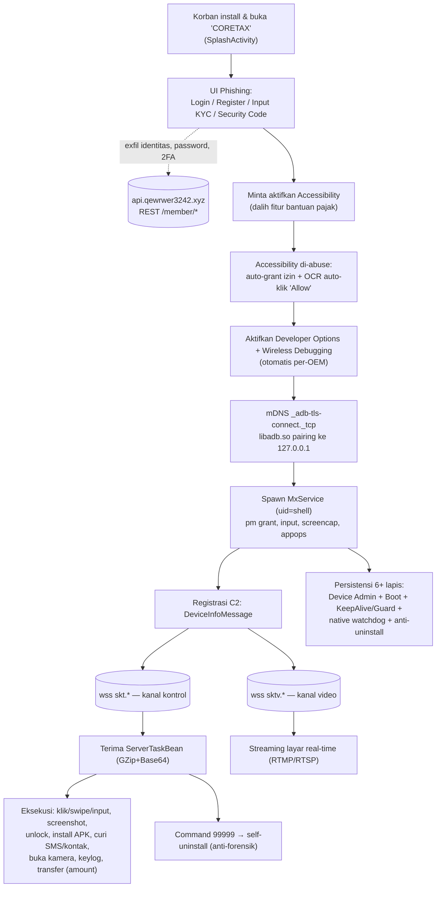

# Analisis Malware "CORETAX.apk" — Laporan Master (IoC + Alur Kerja)

> Dokumen gabungan (master) hasil analisis statik dekompilasi `apktool`/smali. Menyatukan `IoC.md` dan `ANALISIS_CORETAX_MALWARE.md` menjadi satu referensi lengkap untuk deteksi, forensik, dan respons insiden.
> **Peringatan:** Jangan memasang / menjalankan APK ini pada perangkat produksi. Analisis dinamik hanya di lingkungan terisolasi.

---

## Daftar Isi
1. [Ringkasan Eksekutif](#1-ringkasan-eksekutif)
2. [Informasi Sampel](#2-informasi-sampel)
3. [Indikator Jaringan (Network IoC)](#3-indikator-jaringan-network-ioc)
4. [Komponen Aplikasi](#4-komponen-aplikasi)
5. [Izin Berbahaya](#5-izin-berbahaya)
6. [Native Libraries](#6-native-libraries)
7. [Aset (Assets)](#7-aset-assets)
8. [Kapabilitas & Command Set](#8-kapabilitas--command-set)
9. [Exfiltrasi Data & Skema](#9-exfiltrasi-data--skema)
10. [Eskalasi Hak Akses (Privilege Escalation)](#10-eskalasi-hak-akses-privilege-escalation)
11. [Persistensi](#11-persistensi)
12. [Anti-Analisis & Evasion](#12-anti-analisis--evasion)
13. [Penyimpanan Lokal (MMKV & Path)](#13-penyimpanan-lokal-mmkv--path)
14. [Alur Phishing & Pencurian Kredensial](#14-alur-phishing--pencurian-kredensial)
15. [Alur Kerja Malware (Workflow)](#15-alur-kerja-malware-workflow)
16. [Pemetaan MITRE ATT&CK](#16-pemetaan-mitre-attck)
17. [Aturan Deteksi (YARA)](#17-aturan-deteksi-yara)
18. [Rekomendasi Deteksi & Mitigasi](#18-rekomendasi-deteksi--mitigasi)
19. [Catatan Metodologi](#19-catatan-metodologi)

---

## 1. Ringkasan Eksekutif

Aplikasi menyamar sebagai **"CORETAX"** — meniru aplikasi pajak resmi Ditjen Pajak Indonesia (Coretax DJP) — namun sebenarnya adalah **Android RAT (Remote Access Trojan) sekaligus Banking Trojan** dengan kemampuan **On-Device Fraud (ODF)** dan pengambilalihan perangkat penuh.

| Aspek | Temuan |
|---|---|
| **Kelas malware** | Android RAT + Banking Trojan + On-Device Fraud + Spyware |
| **Fungsi utama** | Remote control real-time, phishing kredensial/KYC, keylogging, pencurian SMS/OTP, screen streaming, eskalasi privilege |
| **Penyamaran (lure)** | Aplikasi pajak "CORETAX" (target: Wajib Pajak Indonesia) |
| **Bahasa target** | Indonesia & Vietnam (string developer: Mandarin → indikasi aktor berbahasa Mandarin) |
| **Mekanisme inti** | Abuse **Accessibility Service** + **ADB Wireless Debugging lokal (127.0.0.1)** untuk eskalasi ke hak `shell` (uid 2000) |
| **Kanal C2** | 1× REST (HTTPS) + 2× WebSocket (kontrol & video) |
| **Domain C2** | `qewrwer3242.xyz` (sub: `api`, `skt`, `sktv`) |
| **Persistensi** | 6+ lapis (Boot, Device Admin, KeepAlive/Guard proses ganda, native watchdog, alarm, one-pixel) |
| **Dampak** | Pencurian identitas (KYC), pengambilalihan akun bank/e-wallet, intersepsi OTP, transfer dana otomatis, kontrol penuh perangkat |

---

## 2. Informasi Sampel

| Field | Nilai |
|---|---|
| **File Name** | `Coretax.apk` |
| **File Size** | 30,922,705 bytes (~29.5 MB) |
| **SHA256** | `e63211710bc842869a08d3e392352c5cfccb24ba5c88001322d110e2c233671a` |
| **MD5** | `ef0e332d6d1f2cfee5e64735b595c8b8` |
| **SHA1** | `f6405b382992fd2977afbdf90cb6aa8b1a623363` |
| **Package Name** | `com.cnfvgz.sxwe.rfmly` (acak/obfuscated) |
| **Version** | 1.1.2 (versionCode 12) |
| **Application class** | `com.remote.app.RemoteApplication` |
| **App label** | `CORETAX` |
| **Min SDK** | 31 (Android 12) |
| **Target SDK** | 36 (Android 16) |
| **ABI** | `arm64-v8a`, `armeabi-v7a` |
| **extractNativeLibs** | `false` (native lib dibundel di dalam APK) |

Nama paket internal `com.remote.*` dan `com.ven.assists.*` menunjukkan basis kode dibangun di atas framework otomasi accessibility **Assists** yang dipersenjatai.

---

## 3. Indikator Jaringan (Network IoC)

### 3.1 Server C2 (Command & Control)

| Tipe | URL / Domain | Fungsi |
|---|---|---|
| **WebSocket (Action)** | `wss://skt.qewrwer3242.xyz/ws/device?menberId={id}&deviceId={id}` | C2 utama — perintah kontrol (klik, swipe, screenshot, dsb.) |
| **WebSocket (Video)** | `wss://sktv.qewrwer3242.xyz/ws/device?menberId={id}&deviceId={id}` | Streaming layar (screen recording) |
| **REST API** | `https://api.qewrwer3242.xyz` | Registrasi korban & exfiltrasi data |
| **Domain induk** | `qewrwer3242.xyz` | Root C2 |
| **Subdomain** | `skt.qewrwer3242.xyz`, `sktv.qewrwer3242.xyz`, `api.qewrwer3242.xyz` | — |

> **Signature khas:** parameter typo `menberId=` (seharusnya *memberId*) — cocok untuk deteksi jaringan.
> **Encoding pesan:** payload WebSocket dikompres **GZip** lalu **Base64** (`GZIPOutputStream` + `Base64.encodeToString` di `websocket/a.smali`). Heartbeat dikirim berkala (~10 dtk).

### 3.2 Endpoint REST API (Exfiltrasi) — `POST` ke `https://api.qewrwer3242.xyz`

| Endpoint | Data yang dikirim |
|---|---|
| `/member/info/addDevice` | Registrasi perangkat + info perangkat (DeviceInfoMessage) |
| `/member/info/addDevicePassword` | Password/PIN dari form phishing |
| `/member/info/addsDevicePassword` | Password perangkat (scheduler / WebView bridge) |
| `/member/info/addsKeyboardInput` | Hasil **keylogger** |
| `/member/info/addMessage` | **SMS/OTP** yang diintersepsi |
| `/member/identity_verification/saveInfo` | Data identitas/KYC korban |
| `/member/identity_verification/saveSecurityCode` | Kode keamanan / 2FA |

### 3.3 Jaringan Lokal (Privilege Escalation)

| Indikator | Detail |
|---|---|
| `127.0.0.1` | Target ADB wireless pairing/connect lokal (self-debug) |
| `_adb-tls-connect._tcp` | Layanan **mDNS** untuk menemukan port ADB (`AdbEngine$connectWirelessAdb`, `BootCompletedReceiver`) |

---

## 4. Komponen Aplikasi

### 4.1 Kelas Inti Malware

| Kelas | Fungsi |
|---|---|
| `com.remote.app.RemoteApplication` | Entry point — inisialisasi semua subsistem, `HiddenApiBypass`, MMKV, `device_id` |
| `com.remote.app.ui.activity.SplashActivity` | Launcher (via `SplashActivityAlias`) — routing Login/Guide/Main |
| `com.remote.framework.websocket.a` | ActionWSEngine — kanal perintah C2 utama |
| `com.remote.framework.websocket.e` | VideoWSEngine — kanal streaming layar |
| `com.remote.framework.websocket.action.ActionDispatcher` | Dispatcher — memetakan tipe perintah ke handler |
| `com.remote.server.mx.MxService` / `MxClient` | Binder server/klien **privileged** (operasi setara ADB shell) |
| `com.remote.framework.provider.MxContentProvider` | IPC server — menerima binder dari proses MX privileged |
| `com.ven.assists.service.AssistsService` | Accessibility Service — injeksi sentuh & otomasi UI |
| `com.remote.framework.adb.AdbPairingService` / `AdbEngine`(`e`) | ADB wireless pairing + eskalasi |
| `com.remote.framework.keepalive.KeepAliveService` / `GuardService` | Keep-alive proses ganda |
| `com.remote.framework.keepalive.OnePixelActivity` / `KeepAliveAlarm` / `NativeKeepAlive` | Persistensi tambahan |
| `com.remote.framework.media.screenrecord.ScreenRecordService` | Rekam layar H.264 real-time |
| `com.remote.framework.media.screenshot.ScreenshotService` | Screenshot on-demand |
| `com.remote.framework.activity.CameraActivity` | Akses kamera depan (bypass verifikasi wajah) |
| `com.ven.assists.ui.ClipboardActivity` | Pencurian clipboard |
| `com.remote.framework.ui.activity.FullScreenWebActivity` | WebView phishing + `RemoteWebBridge` (JS `uploadPassword`) |
| `com.remote.framework.receiver.BootCompletedReceiver` | Persistensi boot + auto-reconnect ADB |
| `com.remote.framework.receiver.RemoteDeviceAdminReceiver` | Device Admin — re-enable otomatis |
| `com.remote.framework.accessibility.WordConfig` | Konfigurasi kata kunci accessibility (auto-allow/anti-uninstall) |
| `com.remote.framework.accessibility.scheduler.KeyboardInputScheduler` | **Keylogger** |
| `com.remote.framework.accessibility.scheduler.ScreenLockInputScheduler` | Tangkap PIN/pola layar kunci |

### 4.2 Komponen Terekspos (Exported)

| Komponen | Tipe | Risiko |
|---|---|---|
| `SplashActivity` (via alias) | Activity | Entry `MAIN`/`LAUNCHER` |
| `AssistsService` | Service | `BIND_ACCESSIBILITY_SERVICE`, `exported=true`, priority 10000 |
| `RemoteDeviceAdminReceiver` | Receiver | `BIND_DEVICE_ADMIN`, `exported=true` |
| `BootCompletedReceiver` | Receiver | `directBootAware=true`, priority 999 |
| **`MxContentProvider`** | Provider | **`exported=true` TANPA permission** — permukaan serangan IPC lokal |
| `StartRecordActivity` | Activity | `exported=true` |

### 4.3 Content Provider Authorities

```
com.cnfvgz.sxwe.rfmly.fileprovider
com.cnfvgz.sxwe.rfmly.mx              <- exported=true
com.cnfvgz.sxwe.rfmly.assets.fileprovider
com.cnfvgz.sxwe.rfmly.messenger
```

---

## 5. Izin Berbahaya

| Permission | Risiko |
|---|---|
| `INTERNET` / `ACCESS_NETWORK_STATE` | Komunikasi C2 |
| `CAMERA` | Kamera depan jarak jauh / bypass verifikasi wajah |
| `READ_SMS` | Intersepsi OTP |
| `READ_CONTACTS` / `WRITE_CONTACTS` | Pencurian & manipulasi kontak (smishing) |
| **`WRITE_SECURE_SETTINGS`** | Modifikasi setelan sistem (diberikan via ADB) — sangat berbahaya |
| `FOREGROUND_SERVICE_MEDIA_PROJECTION` | Rekam layar / screenshot |
| `FOREGROUND_SERVICE_MEDIA_PLAYBACK` | Silent audio keep-alive |
| `REQUEST_IGNORE_BATTERY_OPTIMIZATIONS` | Bypass Doze |
| `SCHEDULE_EXACT_ALARM` / `USE_EXACT_ALARM` | Timing presisi health-check |
| `RECEIVE_BOOT_COMPLETED` | Auto-start saat boot |
| `WAKE_LOCK` | Cegah CPU sleep |
| `POST_NOTIFICATIONS` | Notifikasi persisten |
| `READ_EXTERNAL_STORAGE` / `READ_MEDIA_IMAGES` | Akses file/media |

---

## 6. Native Libraries

Terverifikasi dari `apktool.yml` dan `lib/arm64-v8a/` — **5 native lib** (armeabi-v7a juga tersedia):

| Library | Fungsi |
|---|---|
| `libadb.so` | Klien ADB tertanam — pairing & koneksi wireless-debug ke `127.0.0.1` (kripto TLS pairing) |
| `libmx.so` | Engine "MX" **privileged** — screen capture & injeksi sentuh via hak `shell` |
| `libkeepalive.so` | Native watchdog/persistensi (JNI, tak terbunuh oleh Java API) |
| `libmlkit_google_ocr_pipeline.so` | **OCR** (Google MLKit) — membaca teks di layar |
| `libmmkv.so` | Penyimpanan konfigurasi (Tencent MMKV) |

---

## 7. Aset (Assets)

```
assets/adb/{default,google,samsung,xiaomi,oppo,vivo,huawei}.json  <- skrip otomasi accessibility per-OEM
assets/mlkit-google-ocr-models/                                    <- model OCR TFLite
assets/dexopt/baseline.prof(m)
```

File `assets/adb/*.json` berisi kata kunci **multibahasa** (Mandarin, Inggris, **Indonesia**, **Vietnam**) untuk menavigasi Setelan → Opsi Pengembang → *Wireless debugging* → *Pair device with pairing code* secara otomatis. Ini bukti kuat penargetan Indonesia & Vietnam.

Kelas pendukung per-OEM: `SamsungWirelessActive`, `XiaomiWirelessActive`, `OppoWirelessActive`, `VivoWirelessActive`, `HuaweiWirelessActive`, `GoogleWirelessActive`, `DefaultWirelessActive`, `ManualAdbWizard`.

---

## 8. Kapabilitas & Command Set

Perintah C2 dikirim sebagai `ServerTaskBean` dan diproses `ActionDispatcher`. Tabel berikut menggabungkan **ID perintah numerik** (analisis dispatch) dengan **kelas action bernama** (terverifikasi di `com.remote.framework.websocket.action`).

| Command ID | Action / Kelas | Deskripsi |
|---|---|---|
| 10001 | `PhoneInfo` | Exfiltrasi info perangkat |
| 10002 | `SwipeXyAction` | Swipe pada koordinat |
| 10003 | `ClickXyAction` | Tap pada koordinat |
| 10007 | `GetAppListAction` | Daftar aplikasi terpasang (cari app bank/e-wallet) |
| 10008 | `GetSmsListAction` | Baca SMS → `/member/info/addMessage` |
| 10015 | `Back` | Tombol back |
| 10016 | `Home` | Tombol home |
| 10017 | `Menu` | Recent apps |
| 10020 | `LockPhone` | Kunci perangkat |
| 10021 | `UnlockPhoneAction` | **Buka kunci** (`unlockByPin` / `unlockByPassword`) |
| 10025 | `TakeScreenshotAction` | Screenshot on-demand |
| 10034 | `LongClickAction` | Long press |
| 10036 | `DragAction` | Gestur drag |
| 10044 | `OpenApp` | Buka aplikasi apa pun |
| 10045 | `UninstallApp` | Uninstall aplikasi apa pun |
| 10055 | `OpenPassword` | Buka activity input password/PIN |
| — | `CustomSwipeXyAction` | Swipe kustom |
| — | `InputWindowAction` | Ketik teks pada field |
| — | `OpenVideoAction` | Mulai screen streaming (RTMP/RTSP) |
| — | `GetContactListAction` | Curi kontak |
| — | `GetAllPermissionAction` | Auto-grant seluruh izin |
| — | `DownloadApkAction` | **Unduh & pasang APK tahap-2** dari `apkUrl` |
| — | `VerifyWindowAction` | **Buka kamera depan** — bypass verifikasi wajah/liveness (`launchFaceCamera`) |
| 99999 | `UninstallSelf` | **Hapus diri** (anti-forensik) |
| 201 / 202 / 20001 / 10006–10056 (lainnya) | (belum terpetakan) | Kandidat kontrol tambahan |

**Modul pendukung (non-perintah langsung):**
- **Keylogger** — `KeyboardInputScheduler` → `/member/info/addsKeyboardInput`
- **Tangkap PIN/pola kunci** — `ScreenLockInputScheduler`
- **Clipboard theft** — `ClipboardActivity`
- **Manipulasi kontak** — `ven.assists.utils.ContactsUtil` (baca **dan tulis** kontak → smishing / sisip nomor palsu)

---

## 9. Exfiltrasi Data & Skema

### 9.1 `DeviceInfoMessage` (dikirim ke `/member/info/addDevice` & WebSocket)

```
androidVersion, deviceId, phoneBrand, phoneModel, width, height,
electricity, isCharge, isOffScreen, isOpenPermission, isSmsPermissionAllow,
networkOperator, sensor,
enableAutoOpen, enableReConnect, enableLauncher, enableInterceptorUninstall
```

### 9.2 `ServerTaskBean` (perintah dari C2)

```
type, taskId, status, num, showType,
clickXy, longClickXy, longClickDuration,
startXy, endXy, swipeStartX/Y, swipeEndX/Y, swipeDirection, swipeDuration,
inputType, copyText, msg, packageName, bundleId, remoteId,
apkUrl, unInstalPakageName, unLockPwd,        <- install APK / uninstall / buka kunci
amount,                                        <- INDIKATOR FRAUD FINANSIAL
isOpenVideo, isOpenLayout, isShow,
videoPushUrl, videoBitrate, videoFrameRate, videoMode, videoResolutionMagnification
```

> Kehadiran field **`amount`** dan **`unLockPwd`** kuat mengindikasikan **On-Device Fraud** (transfer dana otomatis sambil membuka kunci perangkat korban).

---

## 10. Eskalasi Hak Akses (Privilege Escalation)

Rantai eskalasi paling berbahaya — memberi malware hak setara **ADB shell (uid 2000)** tanpa root:

1. **Accessibility** menavigasi Setelan → aktifkan **Developer Options** (`development_settings_enabled`) & **Wireless debugging** (`adb_wifi_enabled`) — otomatis per-OEM.
2. Aktifkan *"Pair device with pairing code"*, baca kode & port pairing dari layar (OCR/accessibility), temukan port via **mDNS `_adb-tls-connect._tcp`**.
3. `libadb.so` melakukan **TLS pairing ke `127.0.0.1`** — perangkat men-debug dirinya sendiri.
4. Spawn **`MxService`** sebagai proses beruid `shell`, di-bridge ke app via `MxContentProvider` binder.
5. `MxClient` mengeksekusi operasi privileged. Handler `MxService`:

| Handler | Kemampuan (setara ADB shell) |
|---|---|
| `PermissionTransactionHandler` | `pm grant` — beri izin apa pun tanpa dialog |
| `AppOpsTransactionHandler` | Ubah AppOps (overlay, notifikasi) |
| `CommandTransactionHandler` | Eksekusi perintah shell arbitrer |
| `ScreenRecordTransactionHandler` | **Screen capture tanpa dialog** |
| `TouchMonitorTransactionHandler` | **Injeksi sentuh/input** ke seluruh sistem |
| `AccessibilityTransactionHandler`, `ProcessMonitorTransactionHandler`, `LifecycleTransactionHandler` | Kontrol & monitoring |

**Bypass API tersembunyi:** `RemoteApplication.onCreate()` memanggil `org.lsposed.hiddenapibypass.HiddenApiBypass.setHiddenApiExemptions("L")`. Juga memanfaatkan hidden API ala **Rikka/Shizuku** (`rikka.hidden.compat.DeviceIdleControllerApis`) mis. untuk `dumpsys deviceidle whitelist +` (battery whitelist). Izin `WRITE_SECURE_SETTINGS` di manifest sejalan dengan model shell-privilege ini.

---

## 11. Persistensi

| Mekanisme | Kelas | Deskripsi |
|---|---|---|
| **Boot Receiver** | `BootCompletedReceiver` | `BOOT_COMPLETED` / `LOCKED_BOOT_COMPLETED` / `QUICKBOOT_POWERON` → tunggu unlock → auto-reconnect ADB |
| **Foreground Service** | `KeepAliveService` | Foreground `mediaPlayback` + silent audio (`AudioTrack`, volume=0) + WakeLock |
| **Guard Process** | `GuardService` | Proses terpisah `:guard`, memantau & merestart KeepAliveService (~30s) |
| **1-Pixel Activity** | `OnePixelActivity` | Activity 1×1 px (alpha=0) saat layar mati |
| **Alarm Health-check** | `KeepAliveAlarm` | `AlarmManager` periodik merestart layanan mati |
| **Native Watchdog** | `NativeKeepAlive` (`libkeepalive.so`) | Watchdog level proses (C), tak terbunuh Java API |
| **Self-Restart** | `KeepAliveService.onDestroy()` | Restart diri + broadcast `ACTION_RESTART` |
| **Device Admin** | `RemoteDeviceAdminReceiver` | `onDisabled()` mencoba **aktifkan ulang** + panggil `MxClient` |
| **Battery whitelist** | `BatteryOptimizationMonitor` | `dumpsys deviceidle whitelist +` |
| **Anti-uninstall** | Accessibility + `WordConfig` | Pantau `enable_uninstall` (MMKV) + `interceptUnInstallAppName` untuk **menggagalkan penghapusan** |

---

## 12. Anti-Analisis & Evasion

| Teknik | Implementasi |
|---|---|
| **Hidden API Bypass** | `HiddenApiBypass.setHiddenApiExemptions("L")` |
| **Package obfuscated** | Nama acak `com.cnfvgz.sxwe.rfmly`; kode di-R8 (kelas pendukung → 1 huruf) |
| **1-Pixel Activity** | Invisible 1×1 px |
| **Silent Audio** | Audio tak terdengar (volume 0) via `AudioTrack` |
| **Proses terpisah** | `GuardService` di `:guard` — sulit dimatikan serentak |
| **Native watchdog** | `libkeepalive.so` — di luar jangkauan tool Java |
| **Device Admin re-enable** | Cegah pencabutan admin |
| **Self-Uninstall** | Command `99999` — anti-forensik |
| **Exclude From Recents** | Banyak activity `excludeFromRecents=true` |
| **GZip + Base64** | Kompresi & encoding pesan WebSocket |
| **OCR untuk auto-klik** | `TextRecognitionChineseLocator` + MLKit melokalisasi tombol "Allow/Izinkan" |

---

## 13. Penyimpanan Lokal (MMKV & Path)

### 13.1 MMKV Keys

| Key | Tipe | Fungsi |
|---|---|---|
| `device_id` | String (UUID) | ID unik perangkat, dibuat saat pertama jalan |
| `is_login` | Boolean | Status login → routing SplashActivity |
| `adb_has_connected` | Boolean | Tandai koneksi ADB sukses → auto-reconnect saat boot |
| `enable_uninstall` | Boolean | Kontrol perilaku anti-uninstall / self-destruct |
| `member_id` / `accountId` | String | ID korban di sisi C2 |

### 13.2 Path Persistensi

```
/data/data/{pkg}/files/mmkv/                 <- penyimpanan MMKV
/data/data/{pkg}/files/mmkv/mmkv.default     <- file default
Device-protected storage (createDeviceProtectedStorageContext) <- bertahan saat terkunci
```

---

## 14. Alur Phishing & Pencurian Kredensial

UI menampilkan alur seolah aplikasi pajak resmi untuk memanen data sensitif:

| Activity / ViewModel | Aksi | Endpoint |
|---|---|---|
| `LoginActivity` / `LoginViewModel.loginAndUploadDeviceInfo` | Curi kredensial login + upload DeviceInfo | `/member/info/addDevice` |
| `RegisterActivity` / `RegisterViewModel.registerAndLogin` | Curi data registrasi | `/member/info/addDevice` |
| `InputInfoActivity` / `InputInfoViewModel.submitUserInfo` | **Curi identitas/KYC** | `/member/identity_verification/saveInfo` |
| `StepOneCodeActivity` / `StepTwoCodeActivity` / `saveSafeCode` | **Curi kode keamanan/2FA** | `/member/identity_verification/saveSecurityCode` |
| `InputActivity` / `PasswordActivity` / `uploadPassword` | **Curi password/PIN** | `/member/info/addDevicePassword` |
| `FullScreenWebActivity` + `RemoteWebBridge.uploadPassword` | Form phishing berbasis WebView → JS bridge | `/member/info/addsDevicePassword` |

---

## 15. Alur Kerja Malware (Workflow)



**Rantai serang ringkas:**
1. **Infeksi** — sideload APK menyamar "CORETAX".
2. **Rekayasa sosial** — UI phishing memanen kredensial/KYC/2FA/password.
3. **Abuse accessibility** — auto-grant izin, OCR auto-klik dialog.
4. **Eskalasi** — ADB lokal (127.0.0.1) → hak `shell` via MxService.
5. **Registrasi C2** — kirim DeviceInfo, buka 2 WebSocket.
6. **Remote control & surveilans** — jalankan command set, streaming, keylog, curi SMS/OTP.
7. **Fraud** — transfer dana otomatis (`amount`) + unlock jarak jauh.
8. **Persistensi & anti-forensik** — 6+ lapis + self-uninstall.

---

## 16. Pemetaan MITRE ATT&CK (Mobile)

| Technique ID | Nama | Bukti |
|---|---|---|
| T1660 | Phishing | Menyamar app pajak "CORETAX" + form kredensial |
| T1398 | Boot/Logon Init Scripts | `BootCompletedReceiver` (`LOCKED_BOOT_COMPLETED`) |
| T1626 / T1603 | Abuse Elevation (Accessibility/Device Admin/scheduled) | `AssistsService`, `RemoteDeviceAdminReceiver` |
| — | Local ADB pairing → shell uid | `libadb.so` → `127.0.0.1`, `MxService` |
| T1624 / T1541 | Boot/Event Triggered; Foreground Persistence | KeepAlive/Guard |
| T1629 / T1628 | Impair Defenses; Hide Artifacts | Anti-uninstall, exclude-from-recents, OnePixel |
| T1417 | Input Capture (Keylogging) | `KeyboardInputScheduler`, form phishing |
| T1636 | Protected User Data (SMS/Contacts) | `GetSmsListAction`, `GetContactListAction` |
| T1513 / T1512 / T1113 | Screen/Video/Screenshot Capture | ScreenRecord/Screenshot/Camera |
| T1516 | Input Injection | `ClickXy/SwipeXy/LongClick/Drag` |
| T1115 | Clipboard Data | `ClipboardActivity` |
| T1437 | C2 Application Layer Protocol | WebSocket/HTTPS |
| T1646 | Exfiltration Over C2 | REST `/member/*` |
| T1643 | Generate Fraudulent Activity (ODF) | `amount`, `UnlockPhoneAction`, remote control |
| T1418 / T1426 | Software/System Info Discovery | `GetAppList`, `PhoneInfo` |

---

## 17. Aturan Deteksi (YARA)

```yara
rule Coretax_RAT_BankingTrojan {
    meta:
        description = "Detects Coretax Android RAT / Banking Trojan (fake DJP Coretax)"
        author = "Security Analysis"
        date = "2026-07-19"
        hash = "e63211710bc842869a08d3e392352c5cfccb24ba5c88001322d110e2c233671a"

    strings:
        // C2
        $c2_action = "wss://skt.qewrwer3242.xyz/ws/device" ascii
        $c2_video  = "wss://sktv.qewrwer3242.xyz/ws/device" ascii
        $c2_api    = "https://api.qewrwer3242.xyz" ascii
        $c2_typo   = "menberId=" ascii
        // REST endpoints
        $ep1 = "/member/info/addDevice" ascii
        $ep2 = "/member/info/addsKeyboardInput" ascii
        $ep3 = "/member/info/addMessage" ascii
        $ep4 = "/member/identity_verification/saveSecurityCode" ascii
        // Package & classes
        $pkg        = "com.cnfvgz.sxwe.rfmly" ascii
        $app_class  = "com.remote.app.RemoteApplication" ascii
        $mx_client  = "com.remote.server.mx.MxClient" ascii
        $keepalive  = "KeepAliveService" ascii
        $guard      = "GuardService" ascii
        $onepixel   = "OnePixelActivity" ascii
        $accessib   = "AssistsService" ascii
        $devadmin   = "RemoteDeviceAdminReceiver" ascii
        $hidden_api = "HiddenApiBypass" ascii
        // Native libs
        $lib_mx   = "libmx.so" ascii
        $lib_adb  = "libadb.so" ascii
        $lib_keep = "libkeepalive.so" ascii
        $lib_ocr  = "libmlkit_google_ocr_pipeline.so" ascii

    condition:
        uint32(0) == 0x04034b50 and
        (
            any of ($c2_*) or
            2 of ($ep*) or
            ( $pkg and 4 of ($app_class,$mx_client,$keepalive,$guard,$onepixel,$accessib,$devadmin,$hidden_api,$lib_mx,$lib_adb,$lib_keep,$lib_ocr) )
        )
}
```

---

## 18. Rekomendasi Deteksi & Mitigasi

**Network (blokir/monitor):**
- Blokir domain `qewrwer3242.xyz` beserta semua subdomain (`api`, `skt`, `sktv`).
- IDS signature: string `menberId=` pada handshake `wss://.../ws/device`; path REST `/member/info/addDevice`, `/member/info/addsKeyboardInput`, `/member/info/addMessage`, `/member/identity_verification/*`.

**Endpoint / MDM:**
- Deteksi paket `com.cnfvgz.sxwe.rfmly` + authority provider `com.cnfvgz.sxwe.rfmly.*`.
- Alarm bila aplikasi non-sistem meminta **Accessibility + Device Admin + mengaktifkan Wireless Debugging** bersamaan.
- Deteksi aktivasi **Wireless debugging tanpa interaksi** atau pairing ADB ke `127.0.0.1` / query mDNS `_adb-tls-connect._tcp`.
- Deteksi native lib `libmx.so`, `libadb.so`, `libkeepalive.so`, `libmlkit_google_ocr_pipeline.so` di APK pihak ketiga.

**Pengguna / Organisasi:**
- Pasang aplikasi pajak hanya dari sumber resmi (Play Store / situs DJP). Aplikasi pajak sah **tidak** meminta Accessibility, Device Admin, SMS, atau Wireless Debugging.
- Jika terinfeksi: cabut Device Admin lewat **Safe Mode**, matikan Wireless debugging, uninstall; pertimbangkan **factory reset** dan **ganti seluruh kredensial perbankan/OTP** dari perangkat bersih.

---

## 19. Catatan Metodologi

- Analisis **statik** atas hasil `apktool` (smali). Kode di-obfuscate (R8) — nama kelas pendukung dipetakan ke 1 huruf; logika inti tetap terbaca dari nama kelas `com.remote.*`/`com.ven.assists.*` dan konstanta string literal.
- Semua domain, endpoint, kunci Settings/MMKV, dan native lib **diverifikasi dari konstanta string smali** (bukan asumsi).
- ID perintah numerik berasal dari analisis dispatcher; sebagian belum dipetakan ke handler bernama (ditandai "belum terpetakan").
- Analisis **dinamik** (sandbox/instrumentasi Frida) disarankan untuk mengonfirmasi isi `ServerTaskBean` aktual dan payload APK tahap-2 — lakukan hanya di lingkungan terisolasi.

---

*Dokumen ini gabungan dari `IoC.md` dan `ANALISIS_CORETAX_MALWARE.md`, dibuat untuk riset keamanan defensif & respons insiden.*
